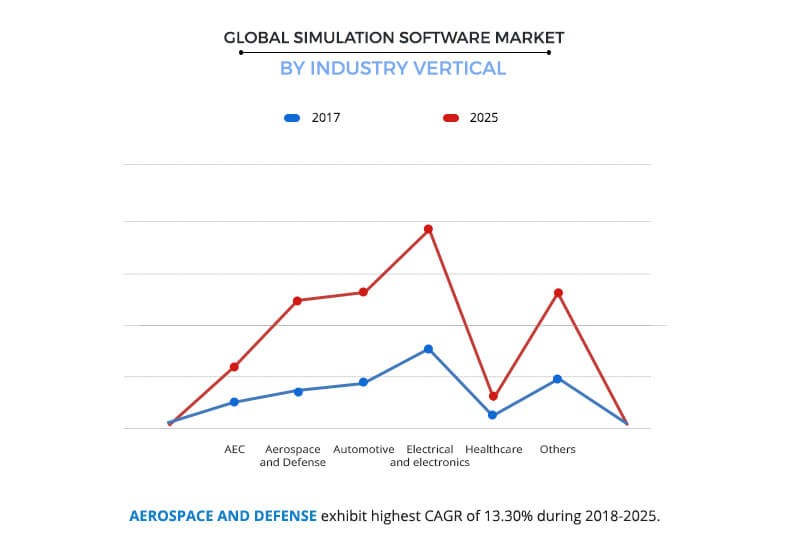

#De stelling opdracht
[terug naar navigatie menu](Portfolio.md)

##"In het bedrijfsleven wordt steeds meer in software gesimuleerd."
In dit stuk ga ik onderzoek doen om de bovenstaande stelling te bevestigen of te ontkrachten.
Hier volgt mijn plan van onderzoek en de conclusie van het onderzoek.

###Wat is een simulatie?
Om erachter te komen hoeveel simulaties worden gebruikt moet ik er eerst achter komen wat een simulatue werkelijk is.
 Na ene tijdje op het internet gezocht te hebben kwam ik een site met een goede definitie:
 Een simulatie is een imitatie van een proces over een bepaalde tijd. Een simulatie volgt vaak een model. 
 Dit model bevat eigenschappen van een of meerdere actoren en constanten van het proces dat wordt gesimuleerd.
 Het model representeert het daadwerkelijke systeem en de simulatie is het model in werking gezet over de tijd. (1)
 
 ###Waarvoor worden simulaties gebruikt in het bedrijfsleven?
 Nu ik weet wat simulaties zijn moet ik onderzoeken waarvoor simulaties in het bedrijfsleven worden gebruikt om erachter te kunnen komen of simulaties meer of minder worden gebruikt dan vroeger.
  Op het internet heb ik gevonden dat simulaties veel worden gebruikt om mensen op te leiden of ervaring op laten doen.
  Bijvoorbeeld er is een simulatie gemaakt waarin chirurgen een operatie kunnen oefenen. Of een simulatie van koers van bedrijven
  worden berekend om zo goede voorspellingen te kunnen op doen in het echte leven. (Bron2) 
 
 ###Hoevaak worden simulaties gebruikt in het bedrijfsleven?
 Na het voorgaande onderzoek ben ik te weten gekomen wat een simulatie is en hoe ze gebruikt kunnen worden.
 Om de stelling te kunnen bevestigen moet ik de hoeveelheid simulaties die tegenwoordig worden gebruikt vergelijken met vroeger.
 Op het internet heb ik deze grafiek gevonden:  
  (3)  de voorspelde simulatie markt vergeleken met 2017  
 De blauwe lijn is de trend in de wereldwijde simulatie software markt in 2017. De rode lijn is de voorspelling van de trend in 2025.  
 Aan de hand van deze grafiek is te zien dat de trend van de simulatie software markt op bijna alle gebieden zal verdubbelen.
  
 
 
 ###Conclusie
 Een simulatie is dus een imitatie van een complex proces. Simulaties worden voornamelijk gebruikt om ervaring op te doen van onzekere situaties.
 Om deze reden is het voor veel bedrijven erg aantrekkelijk om van simulaties gebruik te maken. Wordt er dus in het bedrijfsleven meer gebruik gemaakt van simulatie software?
 Aan de hand van meerdere bronnen is het antwoord ja.
 
 ###Bronnenlijst
Bron 1: [talumis.com](https://www.talumis.com/what-is-simulation/)  
Bron 2: [elearningindustry](https://elearningindustry.com/simulation-based-elearning-3-companies-applied-elearning-different-ways)  
Bron 3: [alliedmarketresearch](https://www.alliedmarketresearch.com/simulation-and-analysis-software-market)