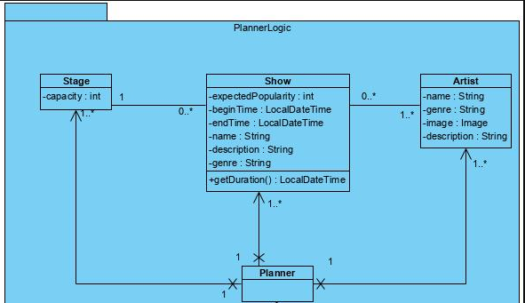

# Week 2
[terug naar selectie menu](Portfolio.md)

##Algemene refectie
Aan het begin van de tweede week gingen we goed van start, we hebben een duidelijke planning gemaakt en de communcatie was duidelijk. 
Wel vond ik het lastig plaatsen hoever de rest van de project groep was en daarom was het lastig om de volgende stappen uit te plannen. Dit zou volgende keer beter kunnen met extra communicatie met bijvoorbeeld discord om ook op afstand een idee te krijgen hoever het project is.

##Inhoudelijke reflectie
Deze week heb ik me vooral gestort op het ontwerp en maken van de Stage, Artist en Show.  
Eerst hadden we gezamenlijk met de groep een globaal ontwerp bedacht met wat die klassen in moesten houden. Uiteindelijk kwamen we uit op dit ontwerp:  
  
Toen ik aan het coderen was leek het mij een handig idee om de stage ook een naam te geven, want dit stond niet op het ontwerp.
Dit zou een paar voordelen hebben: De stage is makkelijker te identificeren en er kan op de GUI makkelijk een stage worden aan gegeven.
Als ik de stage geen naam zou geven is het wel simpeler om een nieuwe stage te creëren. Uiteindelijk heb ik ervoor gekozen om de stage wel een attribuut te geven voor de naam.
Dit leek mij een goed idee omdat het identificeren van een stage later erg nuttig zal zijn en zo kan de stage ook duidelijk worden weergegeven op de GUI.